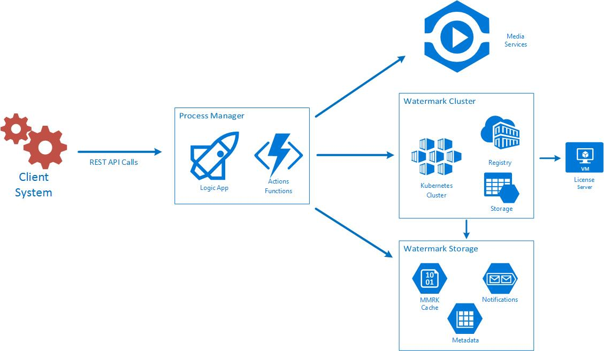

# Introduction 
**MB-Forensic** project is a forensic watermarking automation process running on Azure cloud to apply watermarking on Azure Media Services (AMS) Assets.

**MB-Forensic** is composed by a orchestrate (Logic App), Actions (Azure Functions) and watermarker container on Kubernetes cluster. The process are expose by REST APIs making easy integration with existing MAM or workflows managers. 



# Getting Started
## Installation, build and Test process

*MB-Forensic* installation process is divided on 2 main sub systems

a. Azure Container Service.
Details steps are describe on **k8s\readme.md**

b. Logic Apps and Functions.
Details steps are describe on **ForensicWaterMark\readme.md** file.

## API references
**MB-Forensic** expose 2 simple RESP API to apply watermarking on AMS assets.

### Start watermark Job
Start a new watermark job using **UnifiedProcess** Logic App.
#### Request URL
a. https: //{Logic App Endpoint}.logic.azure.com:443/workflows/{Logic App ID}}/triggers/manual/paths/invoke?api-version=2016-06-01&sp=%2Ftriggers%2Fmanual%2Frun&sv=1.0&sig={Logic App KEY}
#### Request Headers
a. Content-Type: application/json
#### Request Body
POST CALL to CallBack URL specifying **AssetId** of original Assset and **EmbebedCodes** list. Each code on the list will produce a new Asset copy on AMS.

a. **AssetId**: AMS Asset ID string .
b. **EmbebedCodes**: Text list of HEX codes.

```json
{
  "AssetId": "nb:cid:UUID:79d815cc-5cbe-4a99-add9-c74eeeeb596a",
  "EmbebedCodes": 
    [
    	"0x1ADE29"
    ]

}
```
#### Response Body
As response you will receive JOB status information.

```json
{
    "AssetStatus": {
        "AssetId": "nb:cid:UUID:ecda4e79-f800-44de-9fd5-562de140c7c7",
        "State": "Running"
    },
    "JobStatus": {
        "JobID": "08586993026535557503409978660",
        "State": "Running",
        "Details": "Queue",
        "StartTime": "2017-08-09T18:43:54.0835878+00:00",
        "FinishTime": null,
        "Duration": null,
        "EmbebedCodeList": [
            "0x1ADE29"
        ]
    },
    "EmbebedCodesList": [
        {
            "EmbebedCodeValue": "0x1ADE29",
            "State": "Running",
            "ParentAssetID": "nb:cid:UUID:ecda4e79-f800-44de-9fd5-562de140c7c7",
            "AssetID": "",
            "Details": "Just Start"
        }
    ]
}
```
### Watermark Process Status 
Provide job status

#### Request URL
https: //{your Azure Function endpoint }.azurewebsites.net/api/GetUnifiedProcessStatus?code={your Azure Function Key}

#### Request Headers
a. Content-Type: application/json
#### Request Body
Same  Azure Asset ID and **JobID** obtained on preview call response.

a. **AssetId**: AMS Asset ID string.
b. **JobID**: Job Id string.

```json
{
	"AssetId": "nb:cid:UUID:ecda4e79-f800-44de-9fd5-562de140c7c7",
	"JobID": "08586993026535557503409978660"
}
```
#### Response Body
Job Status information.

```json
{
    "AssetStatus": {
        "AssetId": "UUID:ecda4e79-f800-44de-9fd5-562de140c7c7",
        "State": "Finished"
    },
    "JobStatus": {
        "JobID": "08586993026535557503409978660",
        "State": "Finished",
        "Details": "Finished",
        "StartTime": "2017-08-31T16:12:28.1453138Z",
        "FinishTime": "2017-08-31T16:16:02.9693522Z",
        "Duration": "00:03:34.8240384",
        "EmbebedCodeList": [
            "0x2ADA06"
        ]
    },
    "EmbebedCodesList": [
        {
            "EmbebedCodeValue": "0x1ADE29",
            "State": "Finished",
            "ParentAssetID": "nb:cid:UUID:79d815cc-5cbe-4a99-add9-c74eeeeb596a",
            "AssetID": "nb:cid:UUID:7dda66cd-4d12-4f85-94ae-98dbfc516f86",
            "Details": "Ready 5 of 5"
        }
    ]
}
```
a. **AssetStatus**
1. AssetId: Asset ID from original ASM asset. 
2. State: Status of Asset, Finished means ready to embedded code on new MP4 copies.

b. **JobStatus**: Job information.
1. JobID: id of job, same on Logic App run instance id.
2. State: Finished, Running, Failed.
3. Details: state context information.
4. StartTime: Job started date and time.
5. FinishTime: Job finished date and time.
6. Duration: Job duration.
7. EmbebedCodeList: Embedded code list.

c. **EmbebedCodesList**: Individual code status
1. EmbebedCodeValue: embedded code.
2. State: Finished, Running, Failed.
3. ParentAssetID: Original AMS asset ID
4. AssetID: new watermarked copy AMS asset ID.
5. Details: state context information.


# Reporting issues and feedback
If you encounter any bugs with the tool please file an issue in the Issues section of our GitHub repo.

# Contribute

**MB-Forensic**  has adopted the [Microsoft Open Source Code of Conduct](https://opensource.microsoft.com/codeofconduct/).
For more information see the [Code of Conduct FAQ](https://opensource.microsoft.com/codeofconduct/faq/)
or contact [opencode@microsoft.com](mailto:opencode@microsoft.com) with any additional questions or comments.

# License
**MB-Forensic** is licensed under the MIT License.

